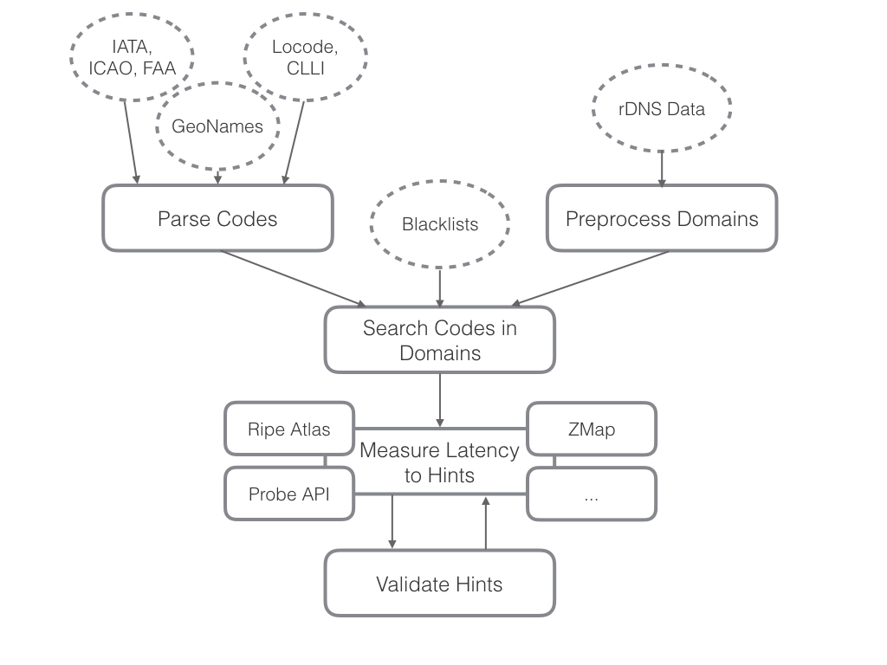

# HLOC: Hints-Based Geolocation Leveraging Multiple Measurement Frameworks

This repository servers both for providing additional data for our publication [branch tma17](https://github.com/tumi8/hloc/tree/tma17) and ongoing development of our tool [branch master](https://github.com/tumi8/hloc).

Our architecture approach:



## Code Collection

Collects codes from the selected sources.

```
python3 -m src.data_processing.codes_parser -a -l src/data_processing/collectedData/locodePart{}.csv -c src/data_processing/collectedData/clli-lat-lon.txt -g src/data_processing/collectedData/cities1000.txt -m 100 -e src/data_processing/collectedData/iata_metropolitan.txt -f locations.json
```

## Pre-Processing

The pre-processing step obtains locations and codes from various sources and merges them into a .json file. We deliver the .json file we have used in our study for convenience.   
It also parses IP/DNS files to a json format, which we can not deliver due to its size.

```
python3 -m src.data_processing.preprocessing <rdns-file> -n <number-of-processes> -t src/data_processing/collectedData/tlds.txt -d preprocessing_output -i -v [ipv4, ipv6]
```

The *number-of-processes* also defines the number of output files.

The format of the rdns-file is:
```
103.13.80.138,xe-2-1-0-2144.a06.sydnau01.au.ra.gin.ntt.net
103.13.80.142,xe-3-0-0-175.a01.sydnau04.au.ra.gin.ntt.net
103.13.80.145,xe-6-1-0.a04.sydnau03.au.ra.gin.ntt.net
```

You can find the files we used in our dataset (see below) under the folder rdns-sources.

## Find

The find step does:

* Convert the location/code json file into a trie
```
python3 -m src.find_and_evaluate.create_trie <locations-file> blacklists/code.blacklist.txt -f blacklists/word.blacklist.txt
```
* Match the IP/DNS json file against this trie
```
python3 -m src.find_and_evaluate.find_locations_with_trie RDNS_DOMAIN_FOLDER/file_name_{}.cor locations-trie.pickle -n <number-of-processes> -e -s blacklists/special.blacklist.txt
```
* Produces a .found json

## Measure

The measure step does:

* Read the .found json from find step
* Conduct measurements with various frameworks
* Produces .measured json files
* Offers a converter to easily legible csv files

## Evaluate

The evaluate step is used for comparison against other location hints provided by e.g., databases or other measurement-based approaches

Measuring and evaluating is combined into one single script:

```
python3 -m src.find_and_evaluate.check_domain_locations RDNS_DOMAIN_FOLDER/file_name_{}-found.json -f <number-of-processes> -loc locations.json -v [ipv4, ipv6] -z zmap-measurements/ipv4-zmap-results -raak RIPE_ATLAS_KEY
```

## Dateset

The data is hosted by the TUM library: [https://mediatum.ub.tum.de/1359182](https://mediatum.ub.tum.de/1359182)

Please note that the `location-codes.json` in the data set unfortunately misses some locations that were rarely used. As the original data set is frozen, we supply the complete file here.


The structure of the data is as follows: 

 -  Input Files
    - Router rdns files:
        - All router rdns entries: `rdns-sources/router.domains.rdns`, format:  
        `1.1.128.44,node-18.pool-1-1.dynamic.totbb.net`     
         `1.1.243.2,node-mpu.pool-1-1.dynamic.totbb.net`  
         `1.122.253.63,cpe-1-122-253-63.wwl9.wel.bigpond.net.au`  
        - DRoP domains: `rdns-sources/`
    - Location File: `location-codes.json`
    - Zmap measurement results:
        - IPv4: `zmap-measurements/ipv4-zmap-results`
        - IPv6: `zmap-measurements/ipv6-zmap-results`
 -  IPv4
    - Preprocessed data: `ipv4`
    - No IP encoded: `ipv4/wo-encoded-ip/`
        - DRoP: `ipv4/wo-encoded-ip/drop/` (Hints/Results from DRoP)
        - IP2Location: `ipv4/wo-encoded-ip/ip2loc/` (Results from IP2Location)
        - GeoLite: `ipv4/wo-encoded-ip/geoip/` (Results from GeoLite)
    - IP encoded: `ipv4/w-encoded-ip/`
        - DRoP: `ipv4/w-encoded-ip/drop`
        - IP2Location: `ipv4/w-encoded-ip/ip2loc/`
        - GeoLite: `ipv4/w-encoded-ip/geoip/`
 -  IPv6
    - Preprocessed data: `ipv6/`
    - No IP encoded: `ipv6/wo-encoded-ip/`
        - DRoP: `ipv6/wo-encoded-ip/drop/`
        - IP2Location: `ipv6/wo-encoded-ip/ip2loc/`
    - IP encoded: `ipv6/w-encoded-ip/`
        - DRoP: `ipv6/w-encoded-ip/drop/`
        - IP2Location: `ipv6/w-encoded-ip/ip2loc/`
 -  DRoP domains
    -  All data in: `drop-main-domains`, with subfolders for each DRoP domain
    -  *HLOC DRoP reproduction* (DRoP hints, HLOC measurements) results are in each domain's subfolder
    -  *HLOC results* (HLOC hints on DRoP domains, HLOC measurements) are in the `hloc-results` subfolder per domain, e.g. `drop-main-domains/ntt.net/hloc-results`

#### File Endings
 These endings are always after the file ending and the process number (`<filename>-<process-number><file-ending>`)

 - After preprocessing
    - Correct (`.cor`)
        All domains not filtered by the preprocessing step
    - Unallowed Characters (`.bad`)
        All domains filtered out for characters not allowed in domains
    - IP encoded (`.ipencoded`)
        Domains which have their own IP encoded in the domain name
    - Invalid TLD (`-dns.bad`)
        All domains with a TLD which is not specified by ICANN (e.g., `.local`)
    - Custom filtered (`-custom-filtered`)
        Domains filtered by a custom blacklist
 - After searching
    - Found (`-found.json`)
        Domains with location matches
    - Not Found (`-not-found.json`)
        Domains without location matches
 - After verifying
    - Checked (`-found.checked`)
        The verified results


